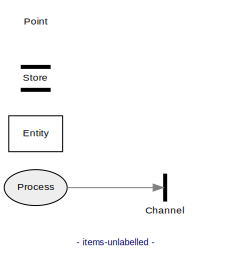
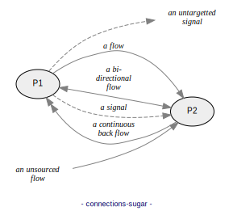
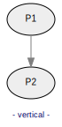
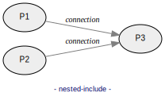

# Data Flow Diagram (DFD)

## A. Syntax

DFD source files consist of a list of statements, one per line:

```
# Line beginning with "#" are comments.
# Empty lines are allowed.

DFD_STATEMENT
DFD_STATEMENT
...
```
### 1. Creating items

Synopsis:
- ```ITEM NAME LABEL```
- where ITEM can be `process`, `entity`, `store`, `channel` or `none`,
- and NAME shall be sort, without whitespaces.

Example:
```data-flow-diagram items.svg
# create a process bubble:
process	P	Do something

# create a terminal rectangle:
entity	T	An entity

# create a store:
store	S	A store

# create a channel
channel	C	A channel

# create a point
none	N	A point

```


- A process is a functional unit that processes inputs and generates outputs.

- An entity is an external actor, outside the scope of the model.

- A store holds data.

- A channel is altering significantly the course of flows, in data or
  timely manner. APIs are channels.

- A point is any item that is e.g. repeated from an upper level.

#### Optional label

The LABEL can be ommitted, in which case the NAME is used in lieu:

```data-flow-diagram items-unlabelled.svg
# create a process bubble:
process	PROC

# create a terminal rectangle:
entity	ENTITY

# create a store:
store	STORE

# create a channel
channel	CHAN

# create a point
none	POINT
```


### 2. Creating connections between items

Synopsis:
- ```CONNECTION FROM_NAME TO_NAME LABEL```
- where CONNECTION can be `flow`, `bflow` or `signal`.

Example:
```data-flow-diagram connections.svg
process	A1
process	A2
process	B1
process	B2
process	C1
process	C2
process	D1
process	D2
process D
process E

# create a directed flow:
flow	A1	A2	a flow

# create a bi-directional flow:
bflow	B1	B2	a bi-directional flow

# create a directed signal:
signal	C1	C2	a signal

# create an undirected flow:
uflow	D1	D2	an undirected flow

# create untargetted connections
flow	*	D	an unsourced\nflow
signal	E	*	an untargetted\nsignal
```


That's it! With items and connections, you can create any DFD diagram of
arbitrary complexity.

#### Syntactic sugars
Syntactic sugars make source easier on the eye:

| Statement with keyword      | Equivalent with syntactic sugar    |
| ----------------------------| -----------------------------------|
| `flow   A B`                | `A --> B` <br/> or <br/>` B <-- A` |
| `bflow  A B`                | `A <-> B` <br/> or <br/> `B <-> A` |
| `uflow  A B`                | `A --- B` <br/> or <br/> `B <-> A` |
| `signal A B`                | `A ::> B` <br/> or <br/> `B <:: A` |

The shaft of the arrow can be of arbitrary lengh, so `->` , `-->` and `------->`
are equivalent.

```data-flow-diagram connections-sugar.svg
process	P1
process	P2

P1 --> P2	a flow
P1 <-> P2	a bi-directional flow
P1 ::> P2	a signal

*  --> P2	an unsourced\nflow
P1 ::> *	an untargetted\nsignal
```



### 3. A simple complete example

```data-flow-diagram complete-example.svg
process	P	Acquire data
process	P2	Compute
entity	T	Device
store	S	Configuration
channel	C	API

T  --> P 	raw data
P  --> P2	raw records
*  ::> P 	clock
S  <-> P2	parameters

P2 --> C  	records
```


### 4. Items rendered only if used (hidable)

By default, all items are rendered, even if not connected to anything:

```data-flow-diagram show-all-items.svg
process	P1	Process 1
process	P2	Process 2
process	P3	Process 3

P1 --> P2	connection
```


A `?` postfix to an item name indicates that, if unused (i.e. not connected to
anything), the item shall be hidden.

Here, *Process 3* is not rendered:

```data-flow-diagram hide-if-unused.svg
process	P1	Process 1
process	P2?	Process 2
process	P3?	Process 3

P1 --> P2	connection
```


### 5. Context diagrams

A top-level, so-called "Context Diagram" can be created by specifying `style context`:

```data-flow-diagram context.svg
style context

process	P	The System
entity  E1  Entity 1
entity  E2  Entity 2
entity  E3  Entity 3
entity  E4  Entity 4

E1  --> P   flow
E2  <-- P   flow
E3  <-> P   flow
E4  ::> P   signal
```


Note that there should be exactly one process.

### 6. Diagram direction

By default, the graph direction is horizontal, so `style horizontal` is implied:

```data-flow-diagram horizontal.svg
style horizontal

process	P1
process P2

P1 --> P2
```


For a top-down direction, use `style vertical`:

```data-flow-diagram vertical.svg
style vertical

process	P1
process P2

P1 --> P2
```


### 7. Relaxed constraints

The placement of items is constrained by both their declaration
order, and also attempt to minimize connection lengths. In the following
diagram, P2 is slightly shifted to shorten `P1 --> P3`:
```data-flow-diagram constraint.svg
style vertical

process	P1
process P2
process P3

P1 -->  P2
P2 -->  P3
P1 -->  P3
```


Sometimes, especially in complex diagrams, adding a connection can bring
a constraint that is not desired. It is possible turn off the constraint posed
by any given connectio, by appending a `?` to the connection:
```data-flow-diagram constraint-relaxed.svg
style vertical

process	P1
process P2
process P3

P1 -->  P2
P2 -->  P3
#P1 -->? P3
# equivalent to: flow? P1 P3
```


- We can see that `P1 --> P3` did not lead `P2` to be shifted.


## B. Markdown snippets

With the command line option `--markdown` (e.g.
`data-flow-diagram README.md --markdown`)
you can embed code blocks that are recognized as Data Flow Diagram snippets.
For each snippet, an image file is generated.

A snippet can be defined by such a code block:

    ```data-flow-diagram FILENAME.svg

    ...DFD_STATEMENTS...

    ```

The opening fence ```` ```data-flow-diagram FILENAME.svg ```` must specify
`data-flow-diagram` as formatter, followed by an output file name with
extension.

Note that only code blocks delimited by triple-backticks fences are considered.
Code blocks defined by quadruple-spaces indentation are ignored.

A generated image file can be used by e.g. ``.

The source file of the present page is using the markdown feature.

## C. Including

Including allows you to reuse a DFD portion (the includee) into another DFD
(the includer).

The includer does it like this:

    #include FILENAME

where `FILENAME` is the path of the includee, which contains DFD statements.

In the markdown case, includee snippets can be defined as follows:

    ```data-flow-diagram NAME
    DFD_STATEMENTS
    ```

and the includer:

    #include #NAME

Nested inclusions are supported, except if they generate an endless loop (recursion).

Read on for more details.

### 1. Including files

You can include a file as includee.

Say we have a file named `includee.part` containing:
```
process	P1	Process 1
process	P2	Process 2
```

In any other DFD we can include the file `includee.part` by
`#include includee.part`:

```data-flow-diagram includer.svg
#include includee.part

P1 --> P2	connection
```

It is equivalent to having:
```
process	P1	Process 1
process	P2	Process 2

P1 --> P2	connection
```


### 2. Including snippet

When using `--markdown`, you can include another snippet of the same document.

#### a. Includee

Here we first define and generate the snippet `includee-snippet-1.svg`.

    ```data-flow-diagram includee-snippet-1.svg
    process	P3	Process 3
    process	P4	Process 4
    ```

The includee generated image can be used: ``


#### b. Includer

Then, we use the snippet `includee-snippet-1.svg` (defined above) by
`#include <includee-snippet-1`. The leading `#` mandates to include a
snippet and not a file. Think of it like an anchor to the markdown snippet.
The output format extension (here `.svg` for
`includee-snippet-1`) must be ommitted.

    ```data-flow-diagram includer-1.svg

    #include #includee-snippet-1

    P3 --> P4	connection
    ```


### 3. Including snippet without generating an image for the includee

Like above, but without generating an image for the includee snippet.

#### a. Includee

Here we first define the snippet `includee-snippet-2`. A leading `#`
mandates to not generate an image for it. Hence it needs no format extension.

    ```data-flow-diagram #includee-snippet-2
    process	P5	Process 5
    process	P6	Process 6
    ```
#### b. Includer

The includer works exactly like in the previous section.

    ```data-flow-diagram includer-2.svg

    #include #includee-snippet-2

    P5 --> P6	connection
    ```


### 4. Nested includes

The following markdown defines nested snippets:

    ```data-flow-diagram #snippet-1
    process	P1
    process	P2
    ```

    ```data-flow-diagram #snippet-2
    #include #snippet-1
    process	P3
    ```

    ```data-flow-diagram nested-include.svg
    #include #snippet-2
    P1 --> P3	connection
    P2 --> P3	connection
    ```

This yields the image: <br/>


Such a snippet (which includes itself) involves an infinite recursion:

    ```data-flow-diagram snippet-recursive.svg
    process	P1
    #include #snippet-recursive
    ```
and would cause this error during image generation:
```
ERROR: (most recent first)
  line 2: #include #snippet-recursive
  line 1: <snippet #snippet-recursive>
  line 2: #include #snippet-recursive
  line 329: <file:README.md><snippet:snippet-recursive.svg>
Error: Recursive include of "#snippet-recursive"
```