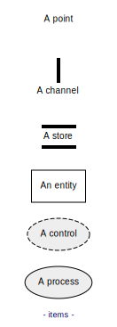
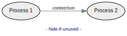
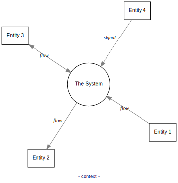
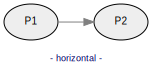
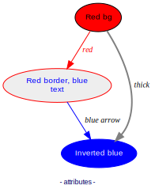
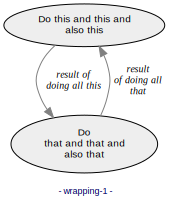
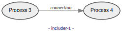
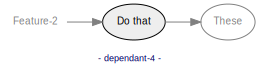

# Data Flow Diagram (DFD)

## A. Syntax

DFD source files consist of a list of statements, one per line:

```
# Line beginning with "#" are comments.
# Empty lines are allowed.

DFD_STATEMENT
DFD_STATEMENT
...
```
### 1. Creating items

Synopsis:
- ```ITEM NAME LABEL```
- where ITEM can be `process`, `entity`, `store`, `channel` or `none`,
- and NAME shall be sort, without whitespaces.

Example:
```data-flow-diagram items.svg
# create a process bubble:
process	P	A Process

# create a terminal rectangle:
entity	T	An entity

# create a store:
store	S	A store

# create a channel
channel	C	A channel

# create a point
none	N	A point

```


- A process is a functional unit that processes inputs and generates outputs.

- An entity is an external actor, outside the scope of the model.

- A store holds data.

- A channel is altering significantly the course of flows, in data or
  timely manner. APIs are channels.

- A point is any item that is e.g. repeated from an upper level.

### 2. Creating connections between items

Synopsis:
- ```CONNECTION FROM_NAME TO_NAME LABEL```
- where CONNECTION can be `flow`, `bflow` or `signal`.

Example:
```data-flow-diagram connections.svg
process	A1
process	A2
process	B1
process	B2
process	C1
process	C2
process	D1
process	D2
process D
process E

# create a directed flow:
flow	A1	A2	a flow

# create a bi-directional flow:
bflow	B1	B2	a bi-directional flow

# create a directed signal:
signal	C1	C2	a signal

# create an undirected flow:
uflow	D1	D2	an undirected flow

# create untargetted connections
flow	*	D	an unsourced flow
signal	E	*	an untargetted signal
```


That's it! With items and connections, you can create any DFD diagram of
arbitrary complexity.

### 3. Syntactic sugars
Syntactic sugars make source easier on the eye:

| Statement with keyword      | Equivalent with syntactic sugar    |
| ----------------------------| -----------------------------------|
| `flow   A B`                | `A --> B` <br/> or <br/>` B <-- A` |
| `bflow  A B`                | `A <-> B` <br/> or <br/> `B <-> A` |
| `uflow  A B`                | `A --- B` <br/> or <br/> `B --- A` |
| `signal A B`                | `A ::> B` <br/> or <br/> `B <:: A` |

The shaft of the arrow can be of arbitrary lengh, so `->` , `-->` and `------->`
are equivalent.

```data-flow-diagram connections-sugar.svg
process	P1
process	P2

P1 --> P2	a flow
P1 <-> P2	a bi-directional flow
P1 ::> P2	a signal

*  --> P2	an unsourced flow
P1 ::> *	an untargetted signal
```


### 4. Optional label

The LABEL can be ommitted, in which case:
- for items, the NAME is used as LABEL,
- for connections, no LABEL is rendered:

```data-flow-diagram items-unlabelled.svg
# create a process bubble:
process	Process

# create a terminal rectangle:
entity	Entity

# create a store:
store	Store

# create a channel
channel	Channel

# create a point
none	Point

# connection
Process --> Channel
```


### 5. Styling

#### a. Per-diagram

The keyword `style` defines rendering parameters for the whole
diagram:

| Style statement                 | Effect                                                       |
| --------------------------------| -------------------------------------------------------------|
| `style context`                 | Makes the diagram a context diagram.                         |
| `style horizontal`              | Layouts flows in the horizontal direction (the default).     |
| `style vertical`                | Layouts flows in the vertical direction.                     |
| `style item-text-width N`       | Sets the items labels wrapping to use N chars columns.       |
| `style connection-text-width N` | Sets the connections labels wrapping to use N chars columns. |

A style apply to the whole diagram, whatever where it is declared in
the source. If a style is re-defined, the last declaration applies.

#### b. Per-item or per-connection

Styling can be applied to a specific item or connection by prefixing
the label by Graphviz attributes in the form.

```
process NAME    [ATTRIBUTES ...] LABEL

ITEM1 --> ITEM2 [ATTRIBUTES ...] LABEL
```
#### Examples

See examples below.

## B. Details with examples

### 1. A simple complete example

```data-flow-diagram complete-example.svg
process	P	Acquire data
process	P2	Compute
entity	T	Device
store	S	Configuration
channel	C	API

T  --> P 	raw data
P  --> P2	raw records
*  ::> P 	clock
S  <-> P2	parameters

P2 --> C  	records
```


### 2. Items rendered only if used (hidable)

By default, all items are rendered, even if not connected to anything:

```data-flow-diagram show-all-items.svg
process	P1	Process 1
process	P2	Process 2
process	P3	Process 3

P1 --> P2	connection
```


A `?` postfix to an item name indicates that, if unused (i.e. not connected to
anything), the item shall be hidden.

Here, *Process 3* is not rendered:

```data-flow-diagram hide-if-unused.svg
process	P1	Process 1
process	P2?	Process 2
process	P3?	Process 3

P1 --> P2	connection
```


### 3. Context diagrams

A top-level, so-called "Context Diagram" can be created by specifying `style context`:

```data-flow-diagram context.svg
style context

process	P	The System
entity  E1  Entity 1
entity  E2  Entity 2
entity  E3  Entity 3
entity  E4  Entity 4

E1  --> P   flow
E2  <-- P   flow
E3  <-> P   flow
E4  ::> P   signal
```


Note that there should be exactly one process.

### 4. Diagram direction

By default, the graph direction is horizontal, so `style horizontal` is implied:

```data-flow-diagram horizontal.svg
style horizontal

process	P1
process P2

P1 --> P2
```


For a top-down direction, use `style vertical`:

```data-flow-diagram vertical.svg
style vertical

process	P1
process P2

P1 --> P2
```


### 5. Relaxed constraints

By default, the placement of items is constrained by both their
declaration order, and also attempt to minimize connection lengths. In
the following diagram, P2 is slightly shifted to shorten `P1 --> P3`:

```data-flow-diagram constraint.svg
style vertical

process	P1
process P2
process P3

P1 -->  P2
P2 -->  P3
P1 -->  P3
```


Sometimes, especially in complex diagrams, adding a connection can bring
a constraint that is not desired. It is possible turn off the constraint posed
by any given connection, by appending a `?` to the connection:
```data-flow-diagram constraint-relaxed.svg
style vertical

process	P1
process P2
process P3

P1 -->  P2
P2 -->  P3
P1 -->? P3
# equivalent to: flow? P1 P3
```


- You can see that `P1 --> P3` did not lead `P2` to be shifted. This
  way, the P1 -> P2 -> P3 alignment reflects a more natural flow.

### 6. Items and connections attributes

Rendering attributes can be added by prefixing the label by
`[NAME=VALUE ...]` using Graphviz attributes syntax:

```data-flow-diagram attributes.svg
style vertical

process	P1  [fillcolor=red] Red bg
process P2  [color=red fontcolor=blue] Red border, blue text
process P3  [fontcolor=white fillcolor=blue color=blue] Inverted blue

P1 -->  P2  [color=red fontcolor=red] red
P2 -->  P3  [color=blue] blue arrow
P1 -->  P3  [penwidth=2] thick
```


For possible attributes, see:
- https://graphviz.org/docs/edges/
- https://graphviz.org/docs/nodes/

Currently, attributes do not apply to `store` nor `channel`.

### 7. Text wrapping and line breaks

Newlines can be inserted in any label by means of `\n`.

Lines are wrapped by default by:
- 20 columns for items, and
- 14 columns for connections:

```
data-flow-diagram wrapping-1.svg
style vertical

process	P1  Do this and this and also this
process P2  Do\n that and that and also that

P1 -->  P2  result of doing all this
P2 -->  P1  result\nof doing all that
```


The column widths can be changed by
- `style item-text-width N` and
- `style connection-text-width N` respectively.

Bigger number of columns:

```data-flow-diagram wrapping-2.svg
#include #wrapping-1
style item-text-width 40
style connection-text-width 40
```


Smaller number of columns:

```data-flow-diagram wrapping-3.svg
#include #wrapping-1
style item-text-width 8
style connection-text-width 6
```


## C. Markdown snippets

With the command line option `--markdown` (e.g.
`data-flow-diagram README.md --markdown`)
you can embed code blocks that are recognized as Data Flow Diagram snippets.
For each snippet, an image file is generated.

A snippet can be defined by such a code block:

    ```data-flow-diagram FILENAME.svg

    DFD_STATEMENTS

    ```

The opening fence ```` ```data-flow-diagram FILENAME.svg ```` must specify
`data-flow-diagram` as formatter, followed by an output file name with
extension.

Some markdown viewers have issues with non-standard formatters on the opening
fence, so an arbitrary number of whitespaces can be inserted between the
opening ```` ``` ```` and the `data-flow-diagram` formatter, like:

    ```
    data-flow-diagram FILENAME.svg

    DFD_STATEMENTS

    ```

Note that only code blocks delimited by triple-backticks fences are considered.
Code blocks defined by quadruple-spaces indentation are ignored:


        data-flow-diagram FILENAME.svg

        DFD_STATEMENTS

        indented code blocks are not captured.


A generated image file can be used by e.g. ``.

The source file of the present page is using the markdown feature.

## C. Including

Including allows you to reuse a DFD portion (the includee) into another DFD
(the includer).

The includer does it like this:

    #include FILENAME

where `FILENAME` is the path of the includee, which contains DFD statements.

In the markdown case, includee snippets can be defined as follows:

    ```data-flow-diagram NAME
    DFD_STATEMENTS
    ```

and the includer:

    #include #NAME

Nested inclusions are supported, except if they generate an endless loop (recursion).

Read on for more details.

### 1. Including files

You can include a file as includee.

Say you have a file named `includee.part` containing:
```
process	P1	Process 1
process	P2	Process 2
```

In any other DFD, you can include the file `includee.part` by
`#include includee.part`:

```data-flow-diagram includer.svg
#include includee.part

P1 --> P2	connection
```

It is equivalent to having:
```
process	P1	Process 1
process	P2	Process 2

P1 --> P2	connection
```


### 2. Including snippet

When using `--markdown`, you can include another snippet of the same document.

#### a. Includee

Here, you first define and generate the snippet `includee-snippet-1.svg`.

    ```data-flow-diagram includee-snippet-1.svg
    process	P3	Process 3
    process	P4	Process 4
    ```

The includee generated image can be used: ``


#### b. Includer

Then, we use the snippet `includee-snippet-1.svg` (defined above) by
`#include <includee-snippet-1`. The leading `#` mandates to include a
snippet and not a file. Think of it like an anchor to the markdown snippet.
The output format extension (here `.svg` for
`includee-snippet-1`) must be ommitted.

    ```data-flow-diagram includer-1.svg

    #include #includee-snippet-1

    P3 --> P4	connection
    ```


### 3. Including snippet without generating an image for the includee

Like above, but without generating an image for the includee snippet.

#### a. Includee

Here we first define the snippet `includee-snippet-2`. A leading `#`
mandates to not generate an image for it. Hence it needs no format extension.

    ```data-flow-diagram #includee-snippet-2
    process	P5	Process 5
    process	P6	Process 6
    ```
#### b. Includer

The includer works exactly like in the previous section.

    ```data-flow-diagram includer-2.svg

    #include #includee-snippet-2

    P5 --> P6	connection
    ```


### 4. Nested includes

The following markdown defines nested snippets:

    ```data-flow-diagram #snippet-1
    process	P1
    process	P2
    ```

    ```data-flow-diagram #snippet-2
    #include #snippet-1
    process	P3
    ```

    ```data-flow-diagram nested-include.svg
    #include #snippet-2
    P1 --> P3	connection
    P2 --> P3	connection
    ```

This yields the image: <br/>


Such a snippet (which includes itself) involves an infinite recursion:

    ```data-flow-diagram snippet-recursive.svg
    process	P1
    #include #snippet-recursive
    ```
and would cause this error during image generation:
```
ERROR: (most recent first)
  line 2: #include #snippet-recursive
  line 1: <snippet #snippet-recursive>
  line 2: #include #snippet-recursive
  line 329: <file:README.md><snippet:snippet-recursive.svg>
Error: Recursive include of "#snippet-recursive"
```

## D. Dependencies

It as a good practice to split a functional diagram in many sub-diagrams
(nested or not), each one of low to medium complexity.

The benefit of better readability comes with a drawback for the writer:
maintaining consistancy. To ease this, the "dependencies" feature comes to help.

You can re-declare items already declared in other graphs. This has the following effects:
1. The item is rendered "ghosted",
2. Inter-dependencies are checked, and result in errors if a reference is not found,
   or of wrong type.

Synopsis:
- `ITEM GRAPH:[NAME]  [LABEL]`
- where `GRAPH` can be `#SNIPPET_NAME` or `FILENAME.EXT`

Examples:
- `none    #MyGraph1:`
- `process #MyGraph1:MyItem`
- `process #MyGraph1:MyItem My item`
- `none    MyGraph2.dfd:`
- `process MyGraph2.dfd:MyItem`
- `process MyGraph2.dfd:MyItem My item`

### 1. Using dependencies
#### a. Referring to another snippet

Supposing you have this (referred) snippet:
```
data-flow-diagram Feature-1.svg
process	This    Do this
```


In another graph (the referrer), you can refer to the whole referred graph by a `none` item:
```data-flow-diagram Referrer-1.svg
# Externals:
none #Feature-1:

# Internals:
process	That    Do that

Feature-1 --> That
```

- `#Feature1` refers to the `Feature-1` snippet,
- `:` without an item name, refers to the whole referred graph.
- The referred graph must be used by its graph name, without the
  `#` snippet prefix; here `Feature-1`.

You can also refer to items inside the referred graph, by declaring an referrer of
the same type, and specifying the referred item name:
```data-flow-diagram Referrer-2.svg
# Externals:
process #Feature-1:This

# Internals:
process	That    Do that

This --> That
```

- `#Feature1` refers to the `Feature-1` snippet.
- `:This` refers to the item named `This` in the referred snippet.
- `process` must be used, in order to be of the same type as the referred item.
- The referred item must be used by its item name; here `This`.
- Since the label is omitted, the name is use instead.

If the referred item has a label that the referrer wants to use, the referrer
must re-declare the label:
```data-flow-diagram Referrer-3.svg
# Externals:
process #Feature-1:This Do this

# Internals:
process	That    Do that

This --> That
```


#### b. Referring to another DFD file

All the latter can be done with referred graph as separate file, instead as snippet.

In such case, the file name of the referred graph shall be used.

Supposing you have a file named `Feature-2.dfd`, and containing:

```
process These	Do these
```

You can refer to the above graph as follows:
```data-flow-diagram dependant-4.svg
# Externals:
none    Feature-2.dfd:
process Feature-2.dfd:These

# Internals:
process	That    Do that

Feature-2   --> That
That        --> These
```

- `Feature-2.dfd` refers to the `Feature-2.dfd` file.
- The `Feature-2` name (without `.dfd` extension) must be further used.
- The same other rules (e.g. accessing items of the referred graph) apply as
  with snippets.

### 2. Checking the dependencies

Dependencies checking lead to error, if any of the following applies:
- The referred graph (snippet or file) does not exist (or is not readable).
- If one refers to a whole graph, the referrer is not of type `none`.
- If one refers to an item of a graph,
  - the referred item does not exist,
  - the referrer and referred items are not of the same type.

To turn off the checking, specify the `--no-check-dependencies` flag to the
command line.