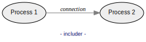
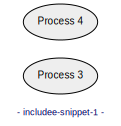

# Data Flow Diagram (DFD)

## A. Syntax

DFD source files consist of a list of statements, one per line:

```
# Line beginning with "#" are comments.
# Empty lines are allowed.

DFD_STATEMENT
DFD_STATEMENT
...
```
### 1. Creating items

Synopsis:
- ```ITEM NAME LABEL```
- where ITEM can be `process`, `entity`, `store` or `channel`.

Example:
```data-flow-diagram items.svg
# create a process bubble:
process	P	Do something

# create a terminal rectangle:
entity	T	An entity

# create a store:
store	S	A store

# create a channel
channel	C	A channel
```


### 2. Creating connections between items

Synopsis:
- ```CONNECTION FROM_NAME TO_NAME LABEL```
- where CONNECTION can be `flow`, `bflow` or `signal`.

Example:
```data-flow-diagram connections.svg
process	A1	A1
process	A2	A2
process	B1	B1
process	B2	B2
process	C1	C1
process	C2	C2
process D	D
process E	E

# create a directed flow:
flow	A1	A2	a flow

# create a bi-directional flow:
bflow	B1	B2	a bi-directional flow

# create a directed signal:
signal	C1	C2	a signal

# create untargetted connections
flow	*	D	an unsourced\nflow
signal	E	*	an untargetted\nsignal
```


That's it! With items and connections, you can create any DFD diagram of
arbitrary complexity.

### 3. A simple complete example

```data-flow-diagram complete-example.svg
style	horizontal

process	P	Acquire data
process	P2	Compute
entity	T	Device
store	S	Configuration
channel	C	API

flow	T	P	raw data
flow	P	P2	raw records
signal	*	P	clock
bflow	S	P2	parameters

flow	P2	C  	records
```


### 4. Items rendered only if used (hidable)

By default, all items are rendered, even if not connected to anything:

```data-flow-diagram show-all-items.svg
process	P1	Process 1
process	P2	Process 2
process	P3	Process 3

flow	P1	P2	connection
```


A `?` postfix to an item name indicates that, if unused (i.e. not connected to
anything), the item shall be hidden.

Here, *Process 3* is not rendered:

```data-flow-diagram hide-if-unused.svg
process	P1	Process 1
process	P2?	Process 2
process	P3?	Process 3
flow	P1	P2	connection
```


## B. Markdown snippets

With the command line option `--markdown` (e.g.
`data-flow-diagram README.md --markdown`)
you can embed code blocks that are recognized as Data Flow Diagram snippets.
For each snippet, an image file is generated.

A snippet can be defined by such a code block:

    ```data-flow-diagram FILENAME.svg

    ...DFD_STATEMENTS...

    ```

The opening fence ```` ```data-flow-diagram FILENAME.svg ```` must specify
`data-flow-diagram` as formatter, followed by an output file name with
extension.

Note that only code blocks delimited by triple-backticks fences are considered.
Code blocks defined by quadruple-spaces indentation are ignored.

A generated image file can be used by e.g. ``.

The source file of the present page is using the markdown feature.

## C. Including

Including allows you to reuse a DFD portion (the includee) into another DFD
(the includer).

The includer does it like this:

    #include FILENAME

where `FILENAME` is the path of the includee, which contains DFD statements.

In the markdown case, includee snippets can be defined as follows:

    ```data-flow-diagram NAME
    DFD_STATEMENTS
    ```

and the includer:

    #include <NAME

Currently, recursive inclusion is not supported.

Read on for more details.

### 1. Including files

You can include a file as includee.

Say we have a file named `includee.dfd` containing:
```
process	P1	Process 1
process	P2	Process 2
```

In any other DFD we can include the file `includee.dfd` by
`#include includee.dfd`:

```data-flow-diagram includer.svg
#include includee.dfd
flow	P1	P2	connection
```

It is equivalent to having:
```
process	P1	Process 1
process	P2	Process 2
flow	P1	P2	connection
```



### 2. Including snippet

When using `--markdown`, you can include another snippet of the same document.

#### a. Includee

Here we first define and generate the snippet `includee-snippet-1.svg`.

    ```data-flow-diagram includee-snippet-1.svg
    process	P3	Process 3
    process	P4	Process 4
    ```

The includee generated image can be used: ``


#### b. Includer

Then, we use the snippet `includee-snippet-1.svg` (defined above) by
`#include <includee-snippet-1`. The leading `<` mandates to include a
snippet and not a file. The output format extension (here `.svg` for
`includee-snippet-1`) must be ommitted.

    ```data-flow-diagram includer-1.svg

    #include <includee-snippet-1

    flow	P3	P4	connection
    ```


### 3. Including snippet without generating an image for the includee

Like above, but without generating an image for the includee snippet.
#### a. Includee

Here we first define the snippet `includee-snippet-2`. The leading `<`
mandates to not generate an image for it. Hence it needs no format extension.

    ```data-flow-diagram <includee-snippet-2
    process	P5	Process 5
    process	P6	Process 6
    ```
#### b. Includer

The includer works exactly like in the previous section.

    ```data-flow-diagram includer-2.svg

    #include <includee-snippet-2

    flow	P5	P6	connection
    ```

