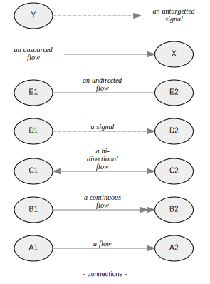
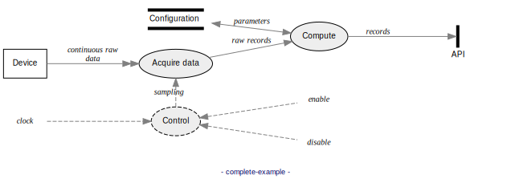
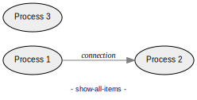
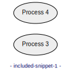
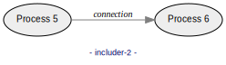

# Data Flow Diagram (DFD)

## A. Syntax

DFD source files consist of a list of statements, one per line.
### 1. Creating items

```data-flow-diagram items.svg

# Line beginning with "#" are comments.
# Empty lines are allowed.

# create a process bubble:
process	P	Do something

# create a terminal rectangle:
entity	T	An entity

# create a store:
store	S	A store

# create a channel
channel	C	A channel
```


### 2. Creating connections between items

```data-flow-diagram connections.svg
process	A1	A1
process	A2	A2
process	B1	B1
process	B2	B2
process	C1	C1
process	C2	C2
process D	D
process E	E

# create all types of connections:
flow	A1	A2	a flow
bflow	B1	B2	a bi-directional flow
signal	C1	C2	a signal

flow	*	D	an unsourced\nconnection
flow	E	*	an untargetted\nconnection
```


### 3. A simple complete example
```data-flow-diagram complete-example.svg
style	horizontal

process	P	Acquire data
process	P2	Compute
entity	T	Device
store	S	Configuration
channel	C	API

flow	T	P	raw data
flow	P	P2	raw records
signal	*	P	clock
bflow	S	P2	parameters

flow	P2	C  	records
```


### 4. Items rendered only if used (hidable)

Here, all items are rendered, even if not connected to anything:

```data-flow-diagram show-all-items.svg
process	P1	Process 1
process	P2	Process 2
process	P3	Process 3

flow	P1	P2	connection
```


A `?` postfix to an item name indicates that the item shall be hidden if unused (i.e. not connected to anything).

Here, *Process 3* is not rendered:

```data-flow-diagram hide-if-unused.svg
process	P1	Process 1
process	P2?	Process 2
process	P3?	Process 3
flow	P1	P2	connection
```


## B. Markdown snippets

With the option `--markdown` (e.g. `data-flow-diagram README.md --markdown`)
you can embed code blocks that are recognized as Data Flow Diagram snippets.
For each snippet, an image file is generated. A snippet can be defined by
such a code block:

    ```data-flow-diagram FILENAME.svg

    ...DFD STATEMENTS...

    ```

Note that only code blocks delimited by triple-backticks fences are considered.
Code blocks defined by quadruple-spaces indentation are ignored.

The generated image file can be used by e.g. ``

## C. Including

Including allows you to reuse a DFD portion (the includee) into another DFD
(the includer).

The includer does it like this:

    #include FILENAME

where `FILENAME` is the path of the includee, which contains DFD statements.

With markdown, includee snippers can be defined as follows:

    ```data-flow-diagram NAME
    STATEMENTS
    ```

and the includer:

    #include <NAME

Read on for more details.

### 1. Including files

You can include a file as includee. Here we include `included-1.dfd`
(which defines P1 and P2) by `#include included-1.dfd`:

```data-flow-diagram includer-1.svg
#include included-1.dfd
flow	P1	P2	connection
```


### 2. Including rendered snippet

When using `--markdown`, you can include another snippet of the same document.

#### a. Includee

Here we first define and generate the snippet `included-snippet-1.svg`.

Code block start fence:

    ```data-flow-diagram included-snippet-1.svg

Code block body:

```data-flow-diagram included-snippet-1.svg
process	P3	Process 3
process	P4	Process 4
```

Inserting the latter snippet image: ``


#### b. Includer

Then, we use the snippet `included-snippet-1.svg` (defined above) by
`#include <included-snippet-1`. The leading `<` mandates to include a
snippet. The output format extension, here `.svg`, must be ommitted.

```data-flow-diagram includer-2.svg
#include <included-snippet-1
flow	P3	P4	connection
```


### 3. Including not-rendered snippet

Like above, you can include another snippet of the same document, but without
rendering said snippet as image file.
#### a. Includee

Here we first define the snippet `included-snippet-2`. The leading `<`
mandates to not render it. Hence it needs no format extension.

Code block start fence:

    ```data-flow-diagram <included-snippet-2

Code block body:

```data-flow-diagram <included-snippet-2
process	P5	Process 5
process	P6	Process 6
```
#### b. Includer

Then, we use the snippet `included-snippet-2` (defined above) by
`#include <included-snippet-2`, like in the previous section.

```data-flow-diagram includer-3.svg
#include <included-snippet-2
flow	P5	P6	connection
```

